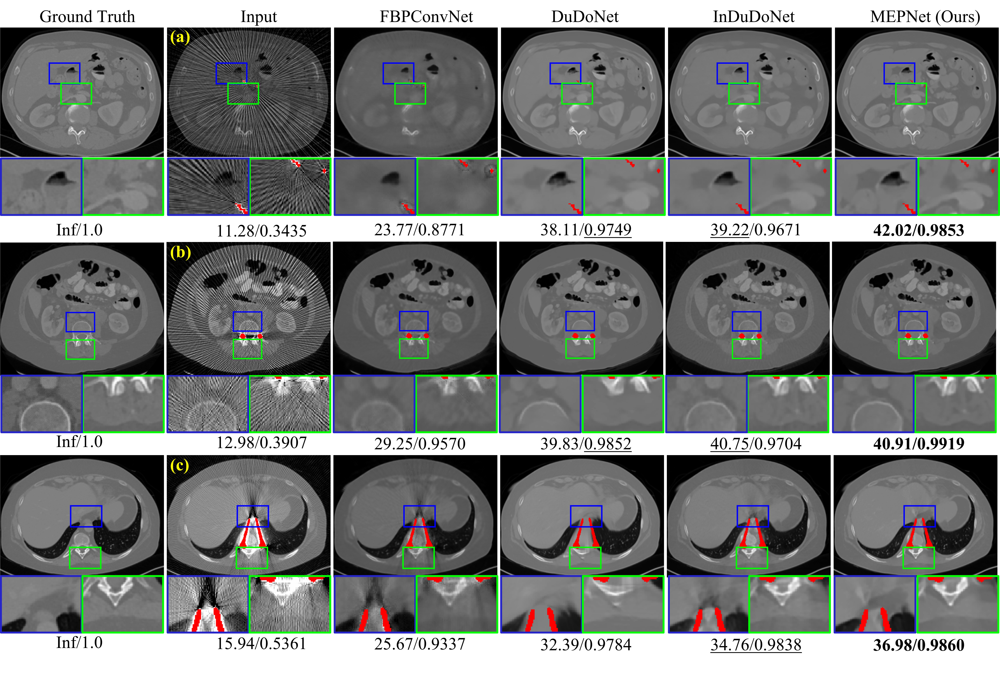
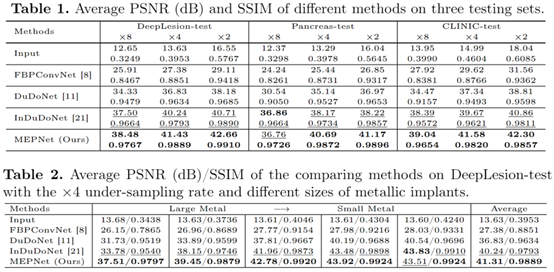

# MEPNet: A Model-Driven Equivariant Proximal Network for Joint Sparse-View Reconstruction and Metal Artifact Reduction in CT Images

[Hong Wang](https://hongwang01.github.io/), Minghao Zhou, Dong Wei, Yuexiang Li, [Yefeng Zheng](https://sites.google.com/site/yefengzheng/)

## Abstract
Sparse-view computed tomography (CT) has been adopted as an important technique for speeding up data acquisition and decreasing radiation dose. However, due to the lack of sufficient projection data, the reconstructed CT images often present severe artifacts, which will be further amplified when patients carry metallic implants. For this joint sparse-view reconstruction and metal artifact reduction task, most of the existing methods are generally confronted with two main limitations: 1) They are almost built based on common network modules without fully embedding the physical imaging geometry constraint of this specific task into the dual-domain learning; 2) Some important prior knowledge is not deeply explored and sufficiently utilized. Against these issues, we specifically construct a dual-domain reconstruction model and propose a model-driven equivariant proximal network, called MEPNet. The main characteristics of MEPNet are: 1) It is optimization-inspired and has a clear working mechanism; 2) The involved proximal operator is modeled via a rotation equivariant convolutional neural network, which finely represents the inherent rotational prior underlying the CT scanning that the same organ can be imaged at different angles. Extensive experiments conducted on several datasets comprehensively substantiate that compared with the conventional convolution-based proximal network, such a rotation equivariance mechanism enables our proposed method to achieve better reconstruction performance with fewer network parameters.

## Visual Experiments

## Quantitative Experiments

## Contact
If you have any question, please feel free to concat Hong Wang (Email: hongwang9209@hotmail.com)

## We will release the code as soon as possible. Thanks.
